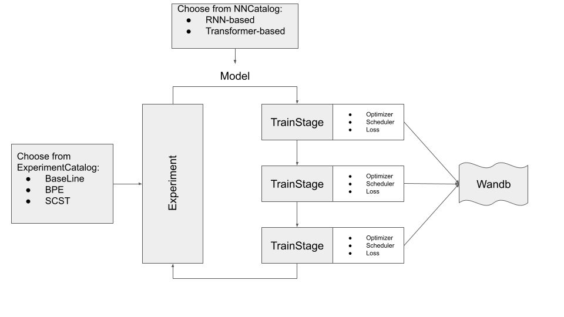
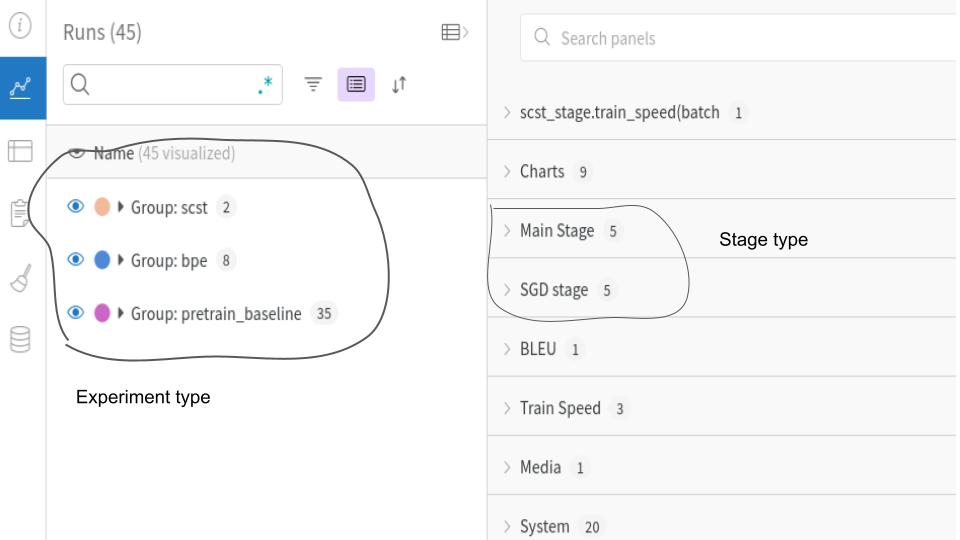

Для удобства разработки была сделана попытка сделать как можно более гибкий шаблон экспериментов. Конечно без костылей не обошлось, однако шаблон сильно упростил расширение библиотеки экспериментов.
Шаблон включает в себя несколько похожих этапов:
* чтение данных
* инициализация моделей
* инициализация оптимизатора и т.д.

Т.к. в данной лабораторной работе все эксперименты проходили с одним и тем же датасетом, получилось добавлять новые эксперименты не путем наследования базового класса, а с помощью интерфейса Train_stage (идейно это общий интерфейс, на практике интерфейс+изолента :D). Т.е. создавались новые Stage'ы и компоновались с помощью ComposeStage, где прогонялись последовательно.

Для логирования использовалась библиотека wandb. Если был запущен где-то wandb.init(), то графики будут логироваться, иначе будет принтится основной лосс на трейне и валидации. Также модели сохраняются в папку с именем run'а из wandb, что может быть достаточно удобным. Так же в папку run'а сохранялся конфиг + мета информация (скорость инференса, время обучения, блеу)  

